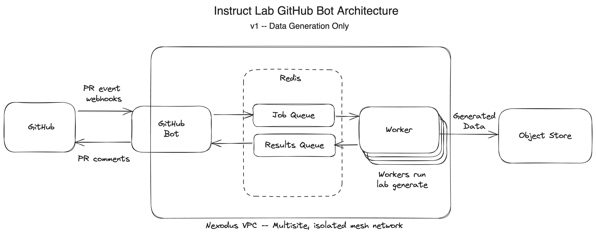

# instructlab-bot

A GitHub bot to increase contributor test and review velocity for
[instructlab/taxonomy](https://github.com/instructlab/taxonomy).

More detail on how this bot fits into the overall architecture is being
captured in this [design
document](docs/github-taxonomy-automation.md).

## Overview

Personas:

- Taxonomy **Contributor**
- Taxonomy **Triager**
- Bot **Admin**

Our goal is to implement a GitHub bot that will:

- Automate major portions of the test and review workflow for taxonomy PRs.
- Stash the generated data and trained models and make them available for download.
- Have the capacity to serve these models for testing purposes.
- Have a way to monitor the system's state -- what builds are available for each
  PR, what jobs are in progress, etc …
  - Contributor / Triager - status via GitHub PR comments from the bot
  - Admin - OTEL, Grafana, etc …

### Current Status

The current iteration is focused on automating the `ilab generate` portion of
the workflow. The following diagram shows the architecture of the bot and its
supporting infrastructure. It supports scaling a pool of workers to run `ilab
generate` jobs. The workers can be located anywhere and will be connect to Redis
over a private mesh network managed by [Nexodus](https://nexodus.io).

The current GitHub workflow in a PR is:

1. PR is opened by the Contributor.
2. User runs `@instructlab-bot generate` in a comment on the PR.
3. Bot generates data using `ilab generate` and stores it in an object store (S3).
4. Bot replies: "Here is the generated data ..."

## Contributing

If you have suggestions for how instructlab-bot could be improved, or want to
report a bug, open an issue! We'd love all and any contributions.

For more, check out the [InstructLab Bot Contribution Guide](CONTRIBUTING.md)
and [InstructLab
Community](https://github.com/instructlab/community/blob/main/CONTRIBUTING.md).

## License

[Apache 2.0](LICENSE)
